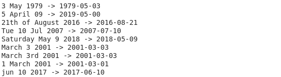
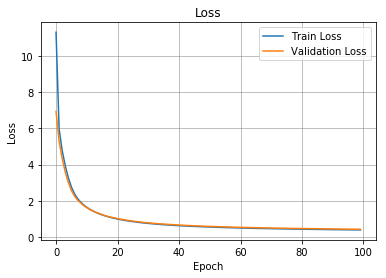

# Attention-Based-Machine-Translation-Demo
A Attention Based machine translation to convert human readable dates to machine readable dates. This was the final week assignment in Angrew Ng's Deep Learning Specialization Course. [Blog for this Project](https://adityajain.me/blogs/attention-model.html)

Example:

[Fork Notebook in Colab](https://colab.research.google.com/drive/12sI5VGknJtSJqmWHTQsNDQrNCQgLz_S-)

## Introduction
Machine translation (MT) refers to fully automated software that can translate source content into target content of different type. Humans may use MT to help them render text and speech into another language, or the MT software may operate without human intervention. Neural Machine Translation is method which utilizes neural networks to achieve this task.

## Diagram of Attention Mechanism
Diagram below on the left shows attention model in one view. The diagram on the left shows one step attention mechanism. Please refer to this [blog](https://adityajain.me/blogs/attention-model.html) for detailed description.

Attention Mode | One step Attention Mechanism 
:-------------------------:|:-------------------------:
 | 

## Training Progress
Below is the loss during trainig process.

## Licence
This project is licensed under the Apache License 2.0 - see the [LICENSE.md](https://github.com/adityajn105/Attention-Based-Machine-Translation-Demo/blob/master/LICENSE) file for details

## Must Read
1. [Google Machine Translation Background](https://google.github.io/seq2seq/nmt/)
2. [Buiding a German to English language translater](https://www.analyticsvidhya.com/blog/2019/01/neural-machine-translation-keras/)
